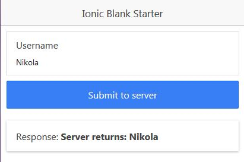
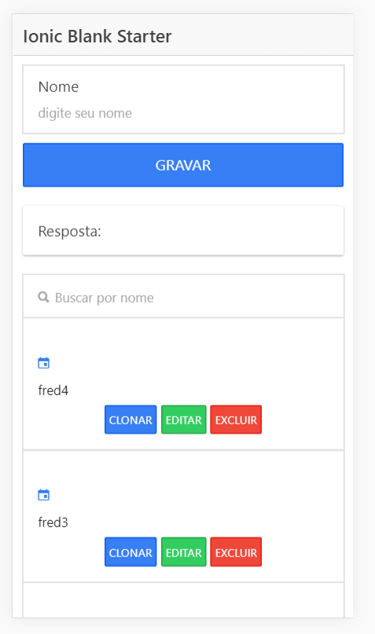

# IonicServerSave
The simplest example on how to POST data from Ionic to PHP server. Tutorial on how to create this step by step can be found [here](http://www.nikola-breznjak.com/blog/ionic/posting-data-from-ionic-app-to-php-server/).

The version for Ionic 2 of this project can be found [here](https://github.com/Hitman666/Ionic2ServerSendTest).

The version for Ionic 3 is [here](https://github.com/Hitman666/Ionic3ServerSendTest).

## Adaptação e melhoria

Agora está com CRUD completo, inclusive clone

--
-- Estrutura da tabela `usuarios`
--

CREATE TABLE `usuarios` (
  `id` int(11) NOT NULL,
  `nome` text NOT NULL
) ENGINE=InnoDB DEFAULT CHARSET=latin1;

--
-- Extraindo dados da tabela `usuarios`
--

INSERT INTO `usuarios` (`id`, `nome`) VALUES
(1, 'fred4'),
(6, 'fred3'),
(8, 'fred2'),
(9, 'fred1');
